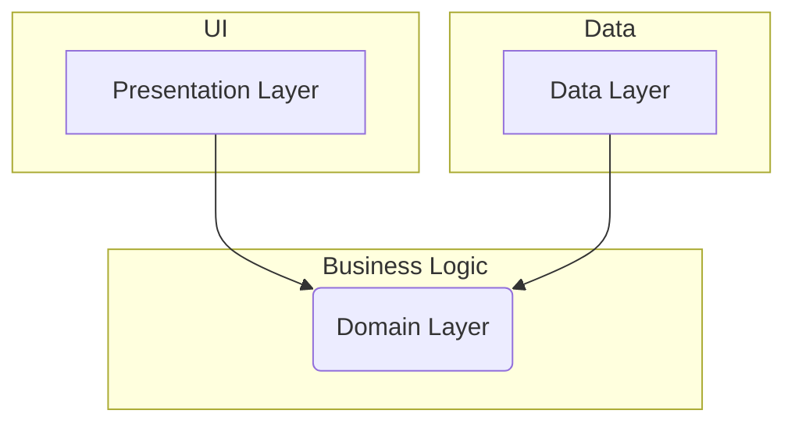

_# 주류마블 안드로이드 앱: 아키텍처 및 개발 계획서

## 1. 개요

이 문서는 '주류마블: 파티 보드게임 앱'의 기술 아키텍처와 MVP(Minimum Viable Product) 개발 계획을 상세히 정의합니다. 본 문서는 개발팀이 일관된 방향성을 가지고 효율적으로 프로젝트를 진행할 수 있도록 가이드하는 것을 목표로 합니다.

프로젝트의 핵심은 오프라인 환경에서 여러 사용자가 하나의 기기로 즐길 수 있는 '패스 앤 플레이' 방식의 보드게임을 구현하는 것입니다. 따라서 초기 아키텍처는 로컬 데이터 처리와 비즈니스 로직의 안정성에 중점을 둡니다.

## 2. 시스템 아키텍처

### 2.1 아키텍처 목표

- **테스트 용이성 (Testability)**: 게임의 핵심 로직(규칙, 턴, 카드 효과)은 UI나 데이터베이스와 독립적으로 테스트할 수 있어야 합니다.
- **유지보수성 (Maintainability)**: 각 기능(UI, 로직, 데이터)이 명확하게 분리되어 코드 수정 및 추가가 용이해야 합니다.
- **확장성 (Scalability)**: MVP 이후 추가될 온라인 멀티플레이, 신규 테마, 콘텐츠 마켓 등의 기능을 수용할 수 있는 유연한 구조를 가져야 합니다.
- **관심사 분리 (Separation of Concerns)**: UI, 비즈니스 로직, 데이터 소스를 명확히 분리하여 각 레이어가 자신의 책임에만 집중하도록 합니다.

### 2.2 MVP 아키텍처: Clean Architecture

요구사항 분석 및 아키텍처 목표에 따라, 본 프로젝트는 구글에서 권장하는 **클린 아키텍처(Clean Architecture)**를 기반으로 설계합니다. [1] 이 아키텍처는 관심사 분리 원칙을 극대화하여 테스트, 유지보수, 확장에 매우 유리합니다.

<br>

**의존성 규칙: 바깥쪽 레이어는 안쪽 레이어를 알 수 있지만, 안쪽 레이어는 바깥쪽 레이어를 알 수 없습니다.**



<br>

- **Presentation Layer (UI Layer)**
    - **역할**: 화면 UI를 표시하고 사용자 입력을 받아 처리합니다. 상태(State)를 관찰하여 UI를 갱신하고, 사용자 액션을 ViewModel에 전달합니다.
    - **주요 기술**: Jetpack Compose (UI 툴킷), ViewModel (상태 관리 및 UI 로직 처리), Navigation (화면 전환).

- **Domain Layer (Game Engine Layer)**
    - **역할**: 앱의 핵심 비즈니스 로직을 포함합니다. 게임 규칙, 턴 관리, 카드 선택, 상태 변경 등 순수한 게임 로직이 여기에 위치합니다. 이 레이어는 Android 프레임워크에 대한 의존성이 없는 순수 Kotlin 모듈로 구성됩니다.
    - **주요 구성**: UseCases (애플리케이션별 비즈니스 규칙), Entities (핵심 비즈니스 객체), Repository Interfaces (데이터 접근 추상화).

- **Data Layer**
    - **역할**: Domain 레이어에서 정의한 인터페이스(Repository)를 구현하며, 데이터의 출처(로컬 DB, 원격 서버 등)를 관리합니다. 데이터의 CRUD(생성, 읽기, 갱신, 삭제)를 담당합니다.
    - **주요 기술**: Room (로컬 데이터베이스), Repository (데이터 소스 제어), Data Sources (Room DAO 등).

### 2.3 기술 스택

| 구분 | 기술 | 사유 |
|---|---|---|
| **언어** | Kotlin | Google의 Android 공식 개발 언어, 생산성 및 안정성. |
| **UI** | Jetpack Compose | 선언형 UI 툴킷으로, 생산성과 코드 간결성을 높임. |
| **아키텍처** | ViewModel, Navigation, Hilt | Google의 공식 아키텍처 컴포넌트로 안정성과 가이드 준수. Hilt는 DI를 통한 의존성 관리 용이. |
| **데이터베이스** | Room Persistence Library | 로컬 데이터 저장을 위한 공식 라이브러리. 컴파일 타임 쿼리 검증. |
| **비동기 처리** | Kotlin Coroutines & Flow | 비동기 작업을 간결하고 구조적으로 처리. 상태 관리와 데이터 스트림에 적합. |
| **테스팅** | JUnit, Mockito, Turbine | 단위/통합 테스트를 위한 표준 라이브러리. Flow 테스트를 위한 Turbine. |

## 3. 안드로이드 프로젝트 구조

클린 아키텍처에 따라 다음과 같은 모듈 및 패키지 구조를 권장합니다.

```
/ (root project)
├── build.gradle.kts
├── settings.gradle.kts
├── /app (Android Application Module)
│   ├── /src/main/java/com/manus/juryumarble
│   │   ├── /di (Hilt 의존성 주입 모듈)
│   │   ├── /presentation (Presentation Layer)
│   │   │   ├── /viewmodel
│   │   │   ├── /ui
│   │   │   │   ├── /theme
│   │   │   │   ├── /component
│   │   │   │   └── /screen
│   │   └── JuryumarbleApplication.kt
│   └── build.gradle.kts
├── /domain (Pure Kotlin Module - Domain Layer)
│   ├── /src/main/java/com/manus/juryumarble/domain
│   │   ├── /model (Entities)
│   │   ├── /repository (Repository Interfaces)
│   │   └── /usecase
│   └── build.gradle.kts
└── /data (Android Library Module - Data Layer)
    ├── /src/main/java/com/manus/juryumarble/data
    │   ├── /repository (Repository Implementations)
    │   ├── /local
    │   │   ├── /db (Room Database, DAO)
    │   │   └── /model (Data Entities)
    │   └── /di (Data Layer DI Module)
    └── build.gradle.kts
```

## 4. MVP 개발 계획 (8주)

3~4인 팀 기준의 8주 MVP 개발 계획입니다. (1인 개발 시 10~12주로 산정)

| 주차 | 주요 목표 | 상세 태스크 | 완료 기준 (Definition of Done) |
|---|---|---|---|
| **0주차** | **요구사항 정의 및 프로토타입** | - 요구사항 분석 및 기능 명세 확정<br>- 핵심 화면 와이어프레임 설계<br>- 상태 머신 다이어그램 초안 작성<br>- 카드 카테고리 및 수위 정책 정의 | - SRS(소프트웨어 요구사항 명세서) v1.0<br>- Figma/손스케치 와이어프레임<br>- 카드 정책 문서 |
| **1-2주차** | **코어 엔진 및 데이터 모델 구축** | - 3개 모듈(app, domain, data) 구조 설정<br>- `domain` 모듈에 Entity(Model) 클래스 구현<br>- `data` 모듈에 Room DB 및 DAO 설정<br>- `domain` 모듈에 턴 기반 상태 머신 로직 구현 | - `GameSession`, `Player` 등 데이터가 로컬 DB에 저장 및 조회 가능<br>- 콘솔/로그 상에서 게임 시작, 턴 진행, 종료 시뮬레이션 가능 |
| **3-4주차** | **핵심 UI 플로우 완성** | - Jetpack Compose를 이용한 화면 구현 (홈, 설정, 게임 보드, 결과)<br>- Navigation Component를 이용한 화면 전환<br>- ViewModel과 Domain Layer 연동<br>- 주사위 굴리기, 말 이동 애니메이션 구현 | - "설정 완료 후 30초 내 게임 시작" 사용자 시나리오 통과<br>- 게임 보드에서 플레이어 말이 정상적으로 이동하고, 이벤트 팝업 노출 |
| **5주차** | **커스터마이징 및 콘텐츠 적용** | - '내 카드 만들기' 기능 구현 (CRUD)<br>- 게임 설정 시 커스텀 덱 포함 기능<br>- 수위 필터(순한/보통/매운맛) 로직 적용<br>- 기본 카드 덱(200개) 리소스 추가 및 파싱 | - 사용자가 생성한 카드가 실제 게임에 등장<br>- '순한맛' 설정 시 '매운맛' 카드가 노출되지 않음 |
| **6주차** | **안정화 및 QA** | - 단위/통합 테스트 코드 작성<br>- 주요 버그 및 엣지 케이스(항복, 덱 고갈 등) 수정<br>- 랜덤 시드(seed) 기반 버그 재현 기능 추가<br>- 저사양 기기 성능 테스트 및 최적화 | - 주요 기능에 대한 테스트 커버리지 50% 이상 달성<br>- 크래시 발생률 1% 미만 |
| **7주차** | **출시 준비** | - 스토어 등록용 스크린샷, 아이콘, 설명 준비<br>- 인앱 튜토리얼 또는 도움말 화면 제작<br>- 책임 음주 관련 고지 문구 최종 검토 및 적용<br>- 최종 UI/UX 폴리싱 | - 구글 플레이 콘솔에 비공개 테스트 버전 업로드 가능<br>- 모든 법적/정책적 고지사항 포함 완료 |
| **8주차** | **런칭 및 운영 준비** | - 최종 릴리스 빌드 생성 및 스토어 제출<br>- 사용자 피드백 수집 채널 마련 (리뷰, 이메일 등)<br>- 2차 로드맵(온라인, 테마 등) 구체화 | - 구글 플레이 스토어 심사 제출<br>- 운영 및 업데이트 계획 문서화 |

---

### 참고 자료
[1] Google Developers. "Guide to app architecture". *Android Developers*. https://developer.android.com/topic/architecture

**[다음 단계]**

다음 단계에서는 게임의 핵심 로직인 **알고리즘 및 게임 로직 설계**를 진행하여, 턴 기반 상태 머신, 카드 시스템, 이벤트 처리 등 구체적인 동작 방식을 정의하겠습니다.
_
