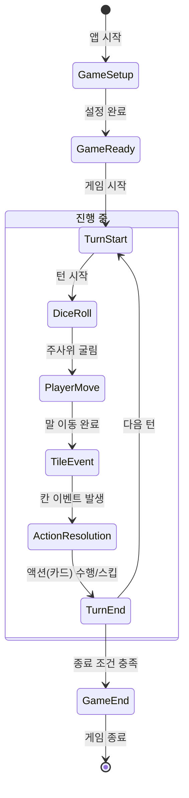

_# 주류마블 안드로이드 앱: 핵심 알고리즘 및 게임 로직 설계서

## 1. 개요

이 문서는 '주류마블' 앱의 핵심 두뇌 역할을 하는 Domain Layer(게임 엔진)의 알고리즘과 로직을 상세하게 정의합니다. 본 설계서는 UI나 데이터와 분리된 순수한 게임 규칙의 작동 방식을 기술하며, 개발자가 일관되고 예측 가능한 코드를 작성할 수 있도록 돕는 것을 목표로 합니다.

## 2. 게임 엔진의 핵심 원칙

- **상태 기반 설계 (State-Driven)**: 게임의 모든 흐름은 명확하게 정의된 '상태(State)'의 전이로 관리됩니다. 이는 코드의 복잡도를 낮추고 예측 가능성을 높입니다.
- **결정론적 랜덤 (Deterministic Randomness)**: 모든 랜덤 요소(주사위, 카드 섞기)는 초기 시드(Seed) 값에 의해 제어됩니다. 동일한 시드와 동일한 입력이 주어지면 항상 동일한 결과가 발생하여, 버그 재현 및 테스트 용이성을 확보합니다.
- **불변성 (Immutability)**: 게임 상태(GameState) 객체는 직접 수정되지 않고, 액션이 발생할 때마다 새로운 상태 객체를 생성하여 반환합니다. 이는 데이터의 흐름을 추적하기 쉽게 만들고, Side Effect를 방지합니다.

## 3. 게임 진행 상태 머신 (Game Flow State Machine)

게임은 시작부터 종료까지 명확한 상태를 따라 진행됩니다. ViewModel은 이 상태를 관찰하여 UI를 갱신합니다.



| 상태 (State) | 설명 | 주요 데이터 |
|---|---|---|
| `GameSetup` | 게임 시작 전, 플레이어 수, 닉네임, 룰 등을 설정하는 상태. | `SessionConfig` |
| `GameReady` | 설정이 완료되고 게임 시작을 대기하는 상태. | `GameState` (초기화) |
| `TurnStart` | 새로운 턴이 시작된 상태. 현재 플레이어를 표시. | `currentPlayerId` |
| `DiceRoll` | 현재 플레이어가 주사위를 굴리기를 기다리는 상태. | `diceButtonEnabled` |
| `PlayerMove` | 주사위 결과에 따라 말이 보드 위에서 이동하는 애니메이션 상태. | `diceResult`, `startPos`, `endPos` |
| `TileEvent` | 말이 도착한 칸의 이벤트를 처리하는 상태. (카드 뽑기, 룰 변경 등) | `tileId`, `triggeredCard` |
| `ActionResolution` | 플레이어가 뽑힌 카드의 내용을 확인하고 수행 여부를 결정하는 상태. | `actionButtons` (수행, 스킵) |
| `TurnEnd` | 현재 턴이 종료되고 다음 턴으로 넘어가기 전의 정리 상태. | `updatedGameState` |
| `GameEnd` | 종료 조건(시간, 라운드, 항복)이 충족되어 게임이 종료된 상태. | `gameResult` (통계) |

## 4. 핵심 알고리즘 상세 설계

### 4.1 게임 초기화 (`InitializeGame` UseCase)

**입력**: `SessionConfig` (플레이어 목록, 룰 프리셋, 커스텀 카드 목록 등)
**출력**: `GameState` (초기 상태)

```kotlin
// Pseudo-code
fun initializeGame(config: SessionConfig): GameState {
    // 1. 랜덤 시드 생성 (현재 시간 기반 또는 지정값)
    val randomSeed = System.currentTimeMillis()
    val random = Random(randomSeed)

    // 2. 플레이어 순서 섞기
    val shuffledPlayers = config.players.shuffled(random)

    // 3. 카드 덱 준비
    // 3.1. 기본 카드 덱 로드
    val baseDeck = loadBaseCards(config.cardPacks)
    // 3.2. 커스텀 카드 추가
    val customDeck = config.customCards
    // 3.3. 수위 필터 적용
    val filteredDeck = (baseDeck + customDeck).filter { card ->
        isCardAllowedBySeverityFilter(card, config.severityFilter)
    }
    // 3.4. 최종 덱 섞기
    val finalDeck = filteredDeck.shuffled(random)

    // 4. 초기 게임 상태 생성
    return GameState(
        sessionId = generateSessionId(),
        randomSeed = randomSeed,
        players = shuffledPlayers,
        board = initializeBoard(shuffledPlayers),
        deck = finalDeck,
        currentTurn = 0,
        status = GameStatus.READY
        // ... 기타 초기값
    )
}
```

### 4.2 턴 진행 알고리즘 (`ProcessTurn` UseCase)

게임의 한 턴은 여러 단계(Phase)로 구성된 파이프라인으로 처리됩니다.

**입력**: `CurrentGameState`, `PlayerAction` (e.g., `RollDiceAction`, `CompleteCardAction`)
**출력**: `NewGameState`

```kotlin
// Pseudo-code for a state reducer
fun reduce(currentState: GameState, action: PlayerAction): GameState {
    when (currentState.turnPhase) {
        TurnPhase.START -> {
            // 다음 턴 플레이어 설정, 턴 시작 상태로 변경
            return handleTurnStart(currentState)
        }
        TurnPhase.DICE_ROLL -> {
            if (action is RollDiceAction) {
                // 주사위 굴리기 및 이동 처리
                return handleDiceRoll(currentState, action)
            }
        }
        TurnPhase.TILE_EVENT -> {
            // 칸 이벤트 처리 (카드 뽑기 등)
            return handleTileEvent(currentState)
        }
        TurnPhase.ACTION_RESOLUTION -> {
            if (action is CompleteCardAction) {
                // 카드 수행 결과 처리
                return handleCardResolution(currentState, action)
            }
        }
        TurnPhase.END -> {
            // 턴 종료 및 다음 턴 준비
            return handleTurnEnd(currentState)
        }
    }
    return currentState // No change
}
```

### 4.3 주사위 굴리기 및 이동 (`handleDiceRoll`)

**알고리즘**:
1.  `random` 객체를 사용하여 주사위 값을 생성합니다. (룰에 따라 1개 또는 2개)
2.  현재 플레이어의 위치(`startPosition`)를 가져옵니다.
3.  주사위 값과 현재 게임 방향(`gameDirection`)을 고려하여 도착 위치(`endPosition`)를 계산합니다.
    - `endPosition = (startPosition + diceSum * gameDirection) % boardSize`
    - 보드 크기를 넘어갈 경우 순환하도록 나머지 연산자(%)를 사용합니다.
4.  플레이어의 위치를 `endPosition`으로 갱신한 새로운 `GameState`를 반환합니다.
5.  턴 상태를 `PlayerMove`를 거쳐 `TileEvent`로 변경합니다.

**특수 규칙 (더블)**:
- 주사위 2개를 굴렸을 때 같은 값이 나오면 `doubleCount`를 1 증가시킵니다.
- `doubleCount`가 3이 되면 무인도로 이동하는 등의 페널티를 적용할 수 있습니다.
- 더블이 나오면 "한 번 더" 기회를 주기 위해 턴 상태를 `DiceRoll`로 다시 설정할 수 있습니다.

### 4.4 카드 뽑기 및 필터링 (`drawCard`)

**알고리즘**:
1.  현재 `GameState`의 `deck`에서 카드를 하나 뽑습니다.
2.  만약 `deck`이 비어있다면, `discardPile`(사용한 카드 더미)을 다시 섞어 `deck`을 재구성합니다.
3.  뽑은 카드의 `targetType`을 확인합니다.
    - `SELF`: 현재 플레이어에게 적용
    - `TARGET_ONE`: 현재 플레이어가 다른 플레이어 한 명을 지목
    - `ALL`: 모든 플레이어에게 적용
    - `ALL_EXCEPT_SELF`: 현재 플레이어를 제외한 모든 플레이어에게 적용
4.  카드 내용의 템플릿 변수(e.g., `{target}`, `{self}`)를 실제 플레이어 닉네임으로 치환합니다.
5.  UI에 표시할 최종 카드 객체(`DisplayableCard`)를 생성하여 `GameState`에 포함시키고, 턴 상태를 `ActionResolution`으로 변경합니다.

### 4.5 벌칙 강도 스케일링

사용자가 설정한 주량/민감도(`toleranceLevel`)와 주종(`drinkType`)에 따라 벌칙의 강도가 동적으로 조절됩니다.

**입력**: `Card`, `Player`
**출력**: `ScaledPenalty` (조정된 벌칙 내용)

```kotlin
// Pseudo-code
fun scalePenalty(card: Card, player: Player, sessionConfig: SessionConfig): String {
    var baseAmount = card.penaltyScale // e.g., 1.0 (1샷 기준)

    // 1. 주량 레벨에 따른 조정
    when (player.toleranceLevel) {
        "LIGHT" -> baseAmount *= 0.5
        "HARD" -> baseAmount *= 1.5
        else -> {} // NORMAL은 기준
    }

    // 2. 주종 단위에 따른 변환
    val unit = sessionConfig.drinkUnit // e.g., "모금", "잔", "샷"
    val finalAmount = ceil(baseAmount) // 소수점 올림

    if (unit == "모금" && sessionConfig.drinkType != "논알콜") {
        // 1샷 = 3모금 과 같은 규칙 적용 가능
        return "${finalAmount * 3} 모금 마시기"
    }

    return "${finalAmount} ${unit} 마시기"
}
```

## 5. 리스크 및 예외 처리

- **덱 고갈**: 카드 덱이 모두 소진되었을 경우, 사용한 카드 덱(`discardPile`)을 다시 섞어 새로운 덱을 생성하는 로직이 반드시 포함되어야 합니다.
- **무한 루프 방지**: 특정 룰(e.g., "더블 시 한 번 더")이 무한 루프를 발생시키지 않도록, 연속 횟수 제한(e.g., 더블 3회 제한)을 두어야 합니다.
- **동시성 문제**: (온라인 확장 시) 여러 사용자의 액션이 동시에 서버에 도달할 경우, 서버는 타임스탬프나 턴 카운터를 기반으로 액션의 순서를 명확히 처리해야 합니다.

---

**[다음 단계]**

이어서, 게임의 재미와 균형을 결정하는 **벌칙 시스템 정의**를 진행하여, 다양한 종류의 벌칙과 그 효과를 구체적으로 설계하겠습니다.
_
